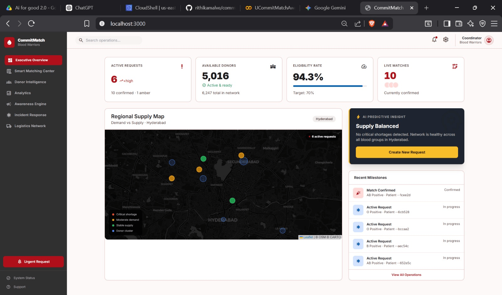

# CommitMatch

AI-powered blood donor matching platform built for the **Blood Warriors NGO** hackathon. CommitMatch connects thalassemia patients with the right blood donors at the right time — using commitment scoring, donation rhythm prediction, and WhatsApp-based outreach to turn "maybe" donors into confirmed life-savers.



---

## What it does

Thalassemia patients need regular transfusions — often every 2–4 weeks. Finding a willing, available, compatible donor in time is a coordination problem that Blood Warriors coordinators solve manually today. CommitMatch automates it:

1. A coordinator creates a blood request for a patient.
2. The system ranks compatible donors by a **commitment score** — factoring in donation history, predicted donation window, past show-rate, and engagement signals.
3. WhatsApp messages are sent to the top-ranked donor (primary) and a backup (standby).
4. Incoming replies are parsed for sentiment; **amber alerts** fire when a donor's reply hints at hesitation.
5. If the primary hasn't confirmed in 4 hours, the standby is automatically promoted.
6. Every confirmation or no-show feeds a **feedback loop** that improves future rankings.

---

## How CommitMatch is different

Most blood donation platforms are **directories** — donors register, patients wait, coordinators cold-call. CommitMatch is built around a different premise: the bottleneck isn't finding donors, it's predicting which donor will actually show up today.

### vs. generic donor-registry apps (iDonate, Blood Connect, etc.)

| | Typical registry app | CommitMatch |
|---|---|---|
| Matching | Blood type filter | Multi-signal commitment score |
| Donor selection | Whoever is "available" | Ranked by predicted readiness |
| Outreach | Mass broadcast | Targeted: 1 primary + 1 standby |
| Hesitation handling | None | Amber alert + standby promotion |
| Learning | None | Feedback loop on every outcome |
| Channel | App push / SMS | WhatsApp (where donors already are) |

Registry apps treat all willing donors as equivalent. CommitMatch treats donor reliability as the core signal — because a donor who commits and no-shows is worse than a donor who never replies.

### vs. hospital blood bank software

Hospital systems are built for inventory management, not outreach coordination. They track units on the shelf, not the humans who might donate next week. CommitMatch sits upstream of the hospital — it solves the "will anyone show up?" problem before a unit ever reaches the bank.

### vs. spreadsheet / CRM workflows (how Blood Warriors worked before)

Manual coordination meant coordinators had to remember which donors were reliable, call them one by one, and track responses in a spreadsheet. CommitMatch encodes that institutional knowledge — donation history, rhythm, show-rate, language preference — into a model that surfaces the right person automatically and escalates without human follow-up.

### What makes the commitment score different from a simple ranking

Most systems rank donors by recency ("last donated 3 months ago → probably eligible"). CommitMatch layers in:

- **Donation rhythm** — each donor has a predicted window based on their personal frequency. A donor who donates every 56 days is ranked higher when their window is open, not just because time has passed.
- **Soft-cancel detection** — reply sentiment is parsed for hedging language. An amber alert fires before a donor formally backs out, giving coordinators time to act.
- **Long-term memory** — show-rate, preferred language, coordinator notes, and past outcomes are stored per donor and factored into future rankings. A donor who no-showed twice gets deprioritized even if they're technically eligible.
- **Self-improving** — every confirmed donation or failure updates the model. The system gets more accurate the more it's used.

### Purpose-built for thalassemia's specific pattern

Thalassemia requires **regular, recurring** transfusions — not one-off emergencies. This changes what matters in a matching system:

- The same small pool of donors is contacted repeatedly. Relationship and reliability history compound over time.
- Timing is predictable: coordinators know weeks in advance when a patient will need blood. CommitMatch uses that lead time to nudge donors before the window closes.
- Coordinator burnout from repeated manual outreach is a real problem. Automation of the routine cases frees coordinators to handle the genuinely hard ones.

---

## Beyond Matching: Blood Coordination Intelligence

CommitMatch started as an AI-powered donor matching system, but the broader vision is to help Blood Warriors coordinate blood availability at scale — not just rank donors.

### The Bridge Network Model

For every patient request, CommitMatch creates a micro-network ("Bridge") of compatible donors. Instead of broadcasting to hundreds of donors, the system identifies:

- **1 Primary Donor** — receives the first outreach
- **1 Standby Donor** — notified in advance that they may be activated if the primary is unavailable
- **Additional compatible donors** within the patient's bridge network

If the primary donor declines or fails to confirm, the standby donor is automatically promoted. If both become unavailable, CommitMatch expands beyond the bridge and allocates donors from the broader compatible pool — ensuring continuity of care without coordinator intervention.

This approach balances donor fatigue, response speed, and coordinator workload.

### Confidence-Aware Response Analysis

Donor responses are not treated as simple yes/no decisions. CommitMatch analyzes WhatsApp replies for intent and confidence. Examples:

- "Yes, I can donate." → confirmed
- "Maybe." / "Shayad." / "I'll try." / "Let me check." → **Amber Alert**

Replies that indicate uncertainty trigger an Amber Alert, allowing coordinators to intervene before a donor formally declines and enabling earlier standby activation — reducing last-minute shortages.

### Coordinator-In-The-Loop Operations

Blood Warriors coordinators remain central to the workflow. The platform provides:

- Request tracking and donor status visibility
- Escalation monitoring and Amber alert management
- Ranking explanations and audit trails of automated decisions

Rather than replacing coordinators, CommitMatch automates repetitive coordination while keeping humans in control of critical decisions.

### Donor Verification Workflow

Trust and reliability improve over time. CommitMatch supports profile verification workflows where:

- Donor profiles can be reviewed automatically
- Coordinators can validate donor information
- Reliability history contributes to future rankings

Verified and consistently reliable donors receive higher prioritization within the matching process.

### Awareness Engine

A major challenge in blood donation is not just matching donors — it is ensuring enough donors are available when needed. CommitMatch includes an Awareness Engine that helps Blood Warriors proactively grow donor participation. The system can:

- Generate awareness campaigns
- Create social media content
- Promote upcoming blood requirements
- Encourage community participation

This helps reduce dependency on reactive donor searches.

### RSVP-Based Donor Mobilization

Awareness campaigns can include RSVP workflows. Interested donors can indicate:

- Availability and preferred donation windows
- Blood group information and willingness to participate

RSVP signals become additional ranking features. When a future request is created, donors who have recently expressed interest are prioritized automatically — creating a continuously refreshed pool of willing donors rather than relying solely on historical databases.

### Hyperlocal Emergency Response

While thalassemia care is generally planned, blood emergencies can arise unexpectedly. CommitMatch supports hyperlocal incident response workflows. For example, if a major traffic accident occurs near Shamshabad, the system can:

- Mark the event as a high-priority emergency
- Identify compatible nearby donors
- Trigger accelerated outreach
- Notify relevant blood banks
- Surface emergency requests on coordinator dashboards

The goal is to reduce response time during critical incidents.

### Outbreak-Aware Risk Management

Public health events can affect donor availability and safety. CommitMatch can incorporate outbreak intelligence and regional health alerts — viral outbreaks, regional disease clusters, public health advisories. Donors from affected regions may be temporarily deprioritized, while coordinators receive visibility into potential impacts on upcoming transfusion schedules. This is particularly important for recurring thalassemia patients who depend on uninterrupted blood access.

### Geographic Operations Dashboard

CommitMatch provides a map-driven operational view for coordinators. The dashboard can display:

- Active blood requests and donor distribution
- Emergency incidents and blood bank locations
- Shortage hotspots and request escalation status

This transforms donor coordination from spreadsheet management into real-time operational awareness.

---

## Architecture

```
Frontend (React + Vite)
    │  REST + WebSocket
    ▼
Backend (FastAPI on AWS Lambda)
    │
    ├── Matching Engine       — ranks donors by commitment score
    ├── Engagement Scorer     — predicts donation rhythm window
    ├── Orchestration         — request lifecycle state machine
    ├── WhatsApp (Twilio)     — sends & receives messages
    ├── AI Layer (Bedrock)    — message generation, hesitation detection, coordinator copilot
    └── Feedback Loop         — records outcomes, tunes scores
    │
    ▼
DynamoDB (9 tables)          AWS EventBridge (3 scheduled jobs)
```

**AWS services used:** Lambda · DynamoDB · API Gateway (WebSocket) · EventBridge · S3

---

## Tech stack

| Layer | Tech |
|---|---|
| Frontend | React, Vite, Tailwind CSS |
| Backend | Python 3.12, FastAPI |
| Database | AWS DynamoDB |
| Messaging | Twilio WhatsApp API |
| AI | Claude Sonnet 4 via AWS Bedrock |
| Infra | AWS Lambda, EventBridge, API Gateway WebSockets |

---

## Key features

- **Commitment scoring** — multi-signal donor ranking (history, rhythm, show-rate, recency)
- **Donation rhythm prediction** — predicts when a donor's next safe window opens
- **Bridge network model** — targeted micro-network of primary + standby + compatible donors per request
- **WhatsApp outreach** — automated messages with sentiment-aware reply parsing
- **Amber alerts** — real-time UI warning when a donor reply suggests soft-cancellation
- **Standby promotion** — auto-escalates to backup donor after 4-hour primary silence
- **Awareness Engine** — campaign generation, social content, and RSVP-driven donor mobilization
- **Hyperlocal emergency response** — accelerated outreach and blood bank notification for critical incidents
- **Outbreak-aware risk management** — deprioritizes donors from regions affected by health alerts
- **Geographic operations dashboard** — map-driven view of requests, donors, shortages, and incidents
- **Shortage detection** — alerts on blood group shortages by city cluster, updated every 6 hours
- **Feedback loop** — no-shows and declines are logged and used to retrain donor scores
- **AI message generation** — Claude (via Bedrock) writes personalised WhatsApp outreach in English, Hindi, or Hinglish
- **Coordinator copilot** — AI suggests the single best next action given current request state, with urgency level
- **Request lifecycle state machine** — tracks each request through `created → ranked → outreach_sent → awaiting_response → confirmed/escalated`

---

## Data model (DynamoDB tables)

| Table | Purpose |
|---|---|
| `commitmatch_donors` | Donor profiles seeded from CSV |
| `commitmatch_patients` | Thalassemia patients (keyed by bridge ID) |
| `commitmatch_requests` | Blood donation requests |
| `commitmatch_rankings` | Per-request donor rankings with signal breakdown |
| `commitmatch_interactions` | WhatsApp inbound/outbound message log |
| `commitmatch_memory` | Donor long-term memory (show-rate, notes, language) |
| `commitmatch_shortage_alerts` | Active shortage alerts by severity |
| `commitmatch_ws_connections` | Live WebSocket connections for real-time push |
| `commitmatch_failure_log` | No-shows, declines, non-responses for feedback |

---

## Scheduled jobs (EventBridge)

| Job | Schedule | What it does |
|---|---|---|
| `standby-promoter` | Every 30 min | Promotes standby if primary silent for 4 hours |
| `rhythm-nudger` | Daily 03:30 UTC | Nudges donors whose window opens within 7 days |
| `shortage-detector` | Every 6 hours | Detects blood group shortages and pushes alerts |

---

## Getting started

### Prerequisites

- Python 3.12+
- Node 18+
- AWS credentials configured (`ap-east-1` region)
- Twilio account with a WhatsApp-enabled number

### Backend

```bash
cd backend
python -m venv venv
venv\Scripts\activate        # Windows
pip install -r requirements.txt

# Copy and fill in your env vars (.env.example is at the repo root)
cp ../.env.example .env

python main.py
# API runs at http://localhost:8000
```

### Frontend

```bash
cd frontend
npm install

cp .env.example .env
# Set VITE_API_URL and VITE_WS_URL

npm run dev
# UI runs at http://localhost:5173
```

### Seed demo data

```bash
python scripts/seed_demo.py
```

---

## Environment variables

**Backend** — copy `.env.example` from the repo root and fill in:

| Variable | Description |
|---|---|
| `AWS_REGION` | AWS region (default: `ap-south-1`) |
| `AWS_ACCESS_KEY_ID` / `AWS_SECRET_ACCESS_KEY` | AWS credentials |
| `DYNAMODB_ENDPOINT` | Leave blank for real DynamoDB; `http://localhost:8000` for local |
| `BEDROCK_MODEL_ID` | Claude model ID on Bedrock |
| `WEBSOCKET_ENDPOINT` | API Gateway WebSocket URL |
| `TWILIO_ACCOUNT_SID` | Twilio account SID |
| `TWILIO_AUTH_TOKEN` | Twilio auth token |
| `TWILIO_WHATSAPP_FROM` | Sending WhatsApp number (`whatsapp:+...`) |
| `DEMO_MODE` | `true` to skip real WhatsApp sends and Bedrock calls |
| `DEMO_WHATSAPP` | `true` to enable real WhatsApp even in demo mode |
| `CSV_PATH` | Path to donor/patient CSV (default: `data/Dataset.csv`) |

**Frontend** — set in `.env`:

| Variable | Description |
|---|---|
| `VITE_API_URL` | Backend API base URL |
| `VITE_WS_URL` | API Gateway WebSocket URL |

---

## Project structure

```
commitmatch/
├── backend/
│   ├── ai/             — Bedrock: outreach messages, hesitation detection, coordinator copilot
│   ├── engagement/     — Donor rhythm & priority scoring
│   ├── learning/       — Feedback loop (confirmation/failure recording)
│   ├── matching/       — Core donor ranking engine
│   ├── memory/         — Donor long-term memory store
│   ├── messaging/      — Twilio WhatsApp send/receive
│   ├── models/         — Pydantic schemas
│   ├── orchestration/  — Request lifecycle state machine
│   ├── routers/        — FastAPI route handlers
│   └── websocket/      — Real-time push via API Gateway
├── frontend/
│   └── src/
│       ├── components/ — AmberAlert, ShortageAlert, etc.
│       └── lib/        — WebSocket client
├── infra/
│   ├── dynamodb_tables.json
│   └── eventbridge_rules.json
├── data/
│   └── Dataset.csv   — Donor seed data
└── scripts/
    └── seed_demo.py
```

---

## From Matching to Coordination Intelligence

Most blood donation platforms focus on finding donors. CommitMatch focuses on **coordinating outcomes**.

By combining donor reliability prediction, confidence-aware communication, bridge networks, awareness campaigns, RSVP-driven engagement, and hyperlocal response workflows, the platform helps Blood Warriors move from reactive coordination to **proactive blood availability management**.
